# Lab 1 – Custom Shell (`s3`)
By Shashank and Archit

## Testing

Testing the commands from the image above

### Task 1 – Basic commands

Testing given commands

→ `whoami`

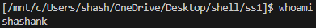

→ `pwd`

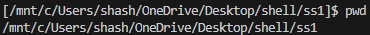

→ `ls`

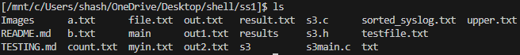

→ `ls -R`

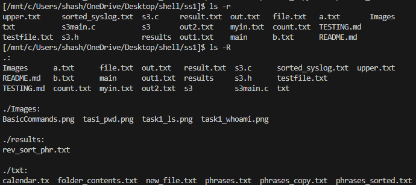

→ `cat txt/phrases.txt`

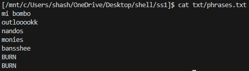

→ `sort txt/phrases.txt`

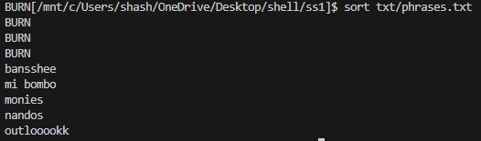

→ `grep -n BURN txt/phrases.txt`

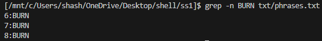

→ `cp txt/phrases.txt txt/phrases_copy.txt`

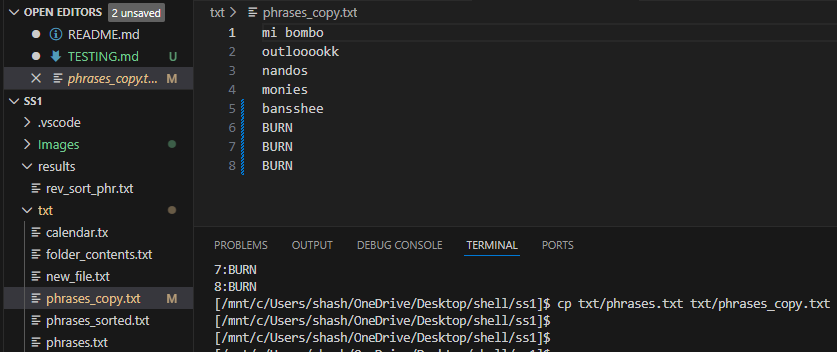

→ `wc txt/phrases.txt`

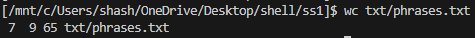

→ `uniq txt/phrases.txt`

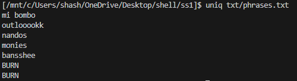

→ `touch txt/new_file.txt`

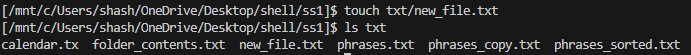

→ `chmod a-w txt/phrases_copy.txt`  
→ `ls -l txt/phrases_copy.txt`

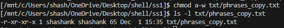

Testing the commands from the image above

### Task 2 – Commands with redirection

Testing given commands

→ `ls > txt/folder_contents.txt`

→ `ls -R > txt/folder_contents.txt`

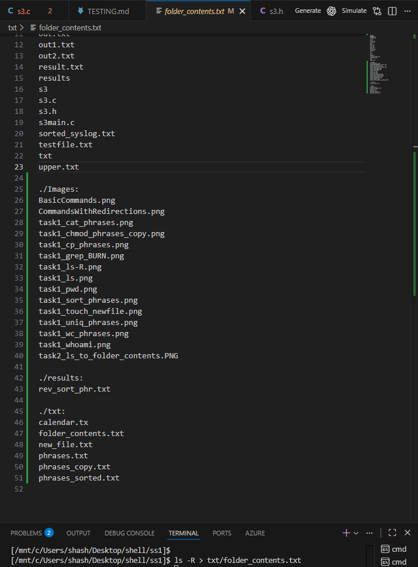

→ `echo "=== Full-Year Calendar ===" > txt/calendar.txt`

→ `echo "June 2024" >> txt/calendar.txt`

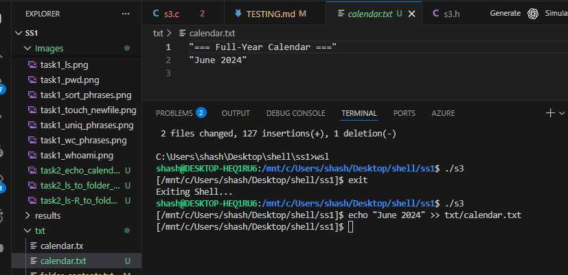

→ `tac txt/phrases.txt > txt/phrases_reversed.txt`

→ `sort txt/phrases.txt > txt/phrases_sorted.txt`

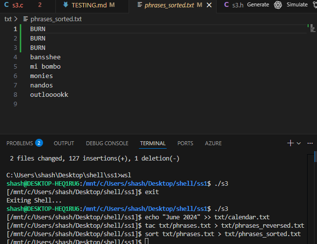

→ `head -n 5 txt/phrases.txt >> txt/phrases_sorted.txt`

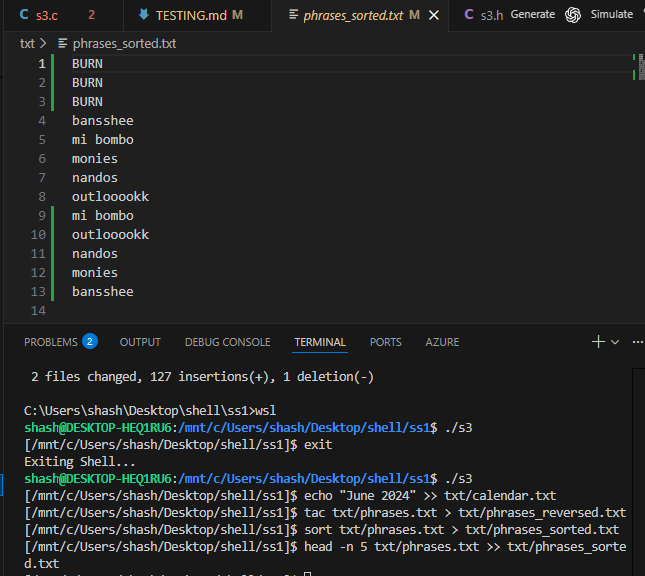

→ `wc txt/phrases.txt > txt/phrases_stats.txt`

→ `grep June < txt/calendar.txt`

→ `tr a-z A-Z < txt/phrases.txt`

### Task 3 – Support for cd

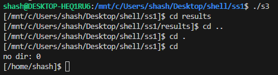

→ `cd txt` takes us into the results directory  
→ `cd ..` takes us back to the previous directory  
→ `cd .` stays in the current working directory  
→ `cd` with no arguments takes us to the user’s home directory

### Task 4 – Commands with pipes

Testing given commands

→ `cat txt/phrases.txt | sort > txt/phrases_sorted.txt`

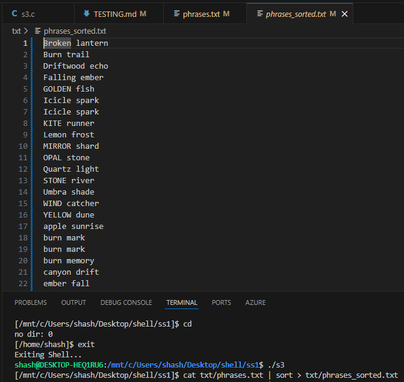

→ `tr a-z A-Z < txt/phrases.txt | grep BURN | sort | wc -l`

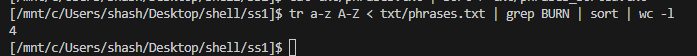

→ `ps aux | grep python | sort -k 3 -nr | head`

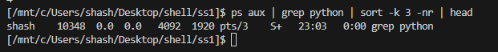

As we can see:

- `cat txt/phrases.txt | sort > txt/phrases_sorted.txt`  
  passes the output of cat through a pipe into sort and the final sorted output is redirected into txt/phrases_sorted.txt.

- `tr a-z A-Z < txt/phrases.txt | grep BURN | sort | wc -l`  
  uses input redirection into tr, then pipes through grep, sort, and finally wc -l, counting how many matching lines there are.

- `ps aux | grep python | sort -k 3 -nr | head`  
    lists all running processes, filters the ones related to Python, sorts them by CPU usage in descending order, and then shows only the top results.
    This demonstrates that the shell can correctly pass data through multiple stages in a longer pipeline.

### Task 5 – Batched commands

Testing given commands

→ `mkdir results ; cat txt/phrases.txt | sort | tac > results/rev_sort_phr.txt ; echo "Processing complete."`

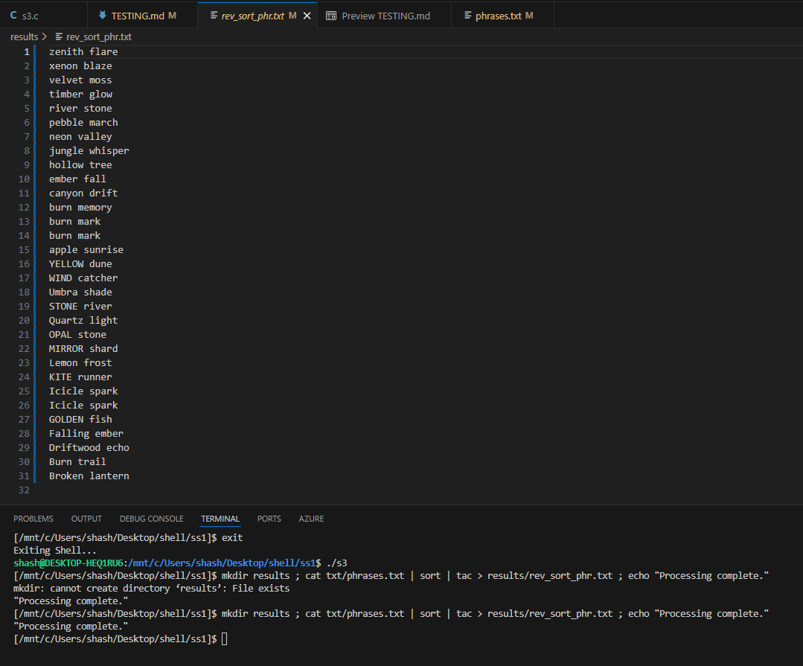

→ `echo "Start processing"; cat txt/phrases.txt | sort > txt/phrases_sorted.txt; head -n 5 txt/phrases.txt; echo "Processing complete"`

→ `sort txt/phrases.txt | uniq > txt/phrases_unique.txt; wc -l txt/phrases_unique.txt`

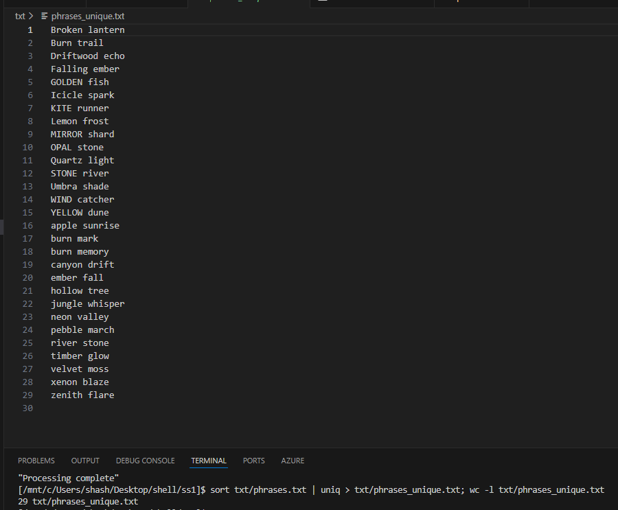

As shown above:

- In the first command mkdir results creates the results directory, the cat | sort | tac pipeline produces a reversed sorted file inside results, and echo prints a completion message. Each part is separated by ; and run in sequence.
- In the second command echo prints a start message, the file is sorted and saved, the first 5 lines are displayed with head, and a final echo confirms completion.
- In the third command, sort and uniq produce a list of unique phrases, and wc -l counts how many unique lines there are.

### Task 6 – Proposed Extension 1: Subshells

Testing given commands

→ `echo "Batch start"; (grep -i burn txt/phrases.txt | sort > txt/phrases_burn_sorted.txt); wc -l txt/phrases_burn_sorted.txt; echo "Batch complete"`

→ `echo "Starting"; (head -n 5 txt/phrases.txt | sort > txt/phrases_top5_sorted.txt); cat txt/phrases_top5_sorted.txt; echo "Finished"`

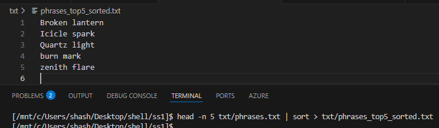

As we can see:

- In the first command everything inside the parentheses runs in a subshell:  
  runs in its own shell process, writes the sorted matches to txt/phrases_burn_sorted.txt, and then the main shell continues with wc -l and the final echo.

- In the second command, the subshell runs  
  head -n 5 txt/phrases.txt | sort > txt/phrases_top5_sorted.txt
  by itself producing a sorted file of the first 5 lines. After the subshell finishes, the main shell prints the contents with cat and then echoes finished.

### Task 7 – Proposed Extension 2: Nested subshells

Testing given commands

→ `echo "Start"; (echo "Outer subshell"; (head -n 3 txt/phrases.txt | sort > txt/top3_sorted.txt); cat txt/top3_sorted.txt); echo "Done"`

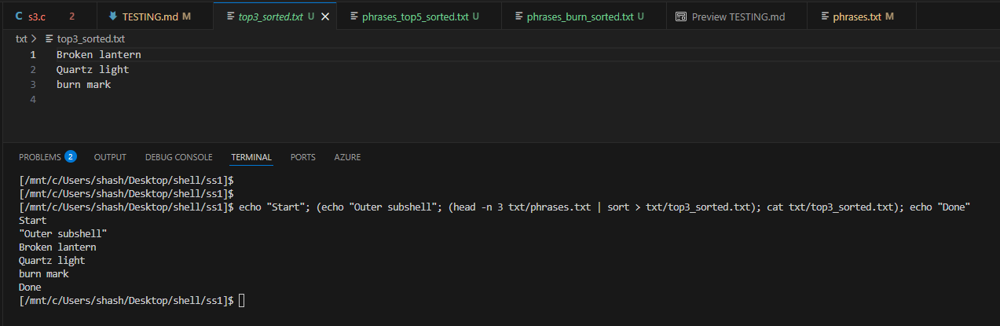

→ `echo "Start"; (cat txt/phrases.txt | head -n 5 > txt/outer_top5.txt; echo "Outer layer"; (sort txt/outer_top5.txt | uniq > txt/middle_unique.txt; echo "Middle layer"; (grep -i burn txt/middle_unique.txt | wc -l > txt/inner_burn_count.txt; echo "Inner layer"))); echo "Done"`

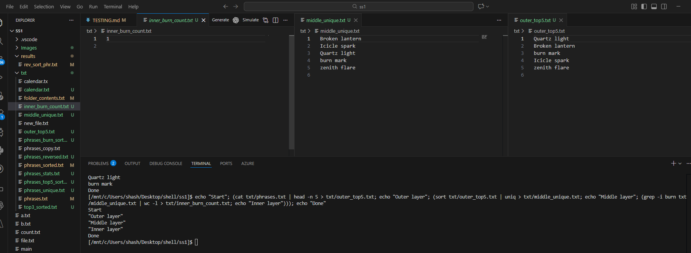

As we can see:

- In the first command, there is a subshell inside another subshell:  
  the outer subshell prints outer layer and then the inner subshell runs  
  `head -n 3 txt/phrases.txt | sort > txt/top3_sorted.txt`,  
  and then the outer subshell prints the sorted file before control returns to the main shell, which prints Done.

- In the second command, three levels of subshells are used:
  - the outer subshell takes the first 5 lines of phrases.txt and writes them to txt/outer_top5.txt, then prints Outer layer;
  - the middle subshell sorts those lines, removes duplicates into txt/middle_unique.txt, and prints Middle layer;
  - the inner subshell runs grep -i burn ... | wc -l to count matching lines and stores the result in txt/inner_burn_count.txt, then prints Inner layer.
  
These examples show that the shell correctly supports subshells nested to multiple levels, with each nested group running in its own child shell while still interacting through files and pipelines.

